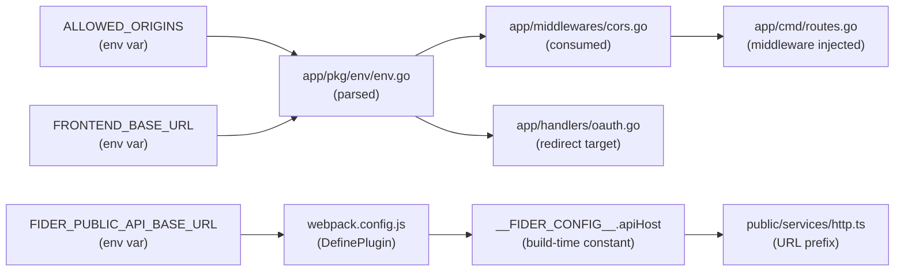

# Technical Specification

# 0. Agent Action Plan

## 0.1 Intent Clarification

### 0.1.1 Core Refactoring Objective

Based on the prompt, the Blitzy platform understands that the refactoring objective is to **structurally decompose the Fider monorepo** (`github.com/getfider/fider`) into two independently deployable repositories — a **frontend SPA** (React 18 / TypeScript) and a **headless backend API** (Go 1.22) — while preserving every existing functional behavior, data contract, and authentication flow.

- **Refactoring Type:** Monolith-to-Decoupled Architecture (Repository Separation + SSR Removal + Cross-Origin Communication Bridge)
- **Target Repository:** Two new independent repositories derived from the same monorepo — one for the frontend (extracted from `public/`, `locale/`, and root-level build config) and one for the backend (extracted from `app/`, `migrations/`, `views/`, and root-level Go/Docker/env config)
- **Refactoring Goals:**
  - **Goal 1 — Repository Separation:** Extract the React/TypeScript SPA from `public/` into a standalone frontend repository with its own `package.json`, `webpack.config.js`, `tsconfig.json`, `lingui.config.js`, `Dockerfile`, and `.example.env`
  - **Goal 2 — SSR Removal:** Eliminate all V8/v8go server-side rendering code paths in the backend. The backend must never return rendered React HTML — only JSON from API endpoints or minimal HTML shells from page-serving routes
  - **Goal 3 — CORS Bridge:** Introduce a production-grade CORS middleware at the router level in `app/cmd/routes.go` that reads an `ALLOWED_ORIGINS` env var and sets appropriate `Access-Control-*` headers on every response, with proper OPTIONS preflight handling
  - **Goal 4 — Bearer Token Authentication:** Extend `app/middlewares/user.go` to accept JWT tokens via the `Authorization: Bearer` header in addition to the existing `auth` cookie, enabling cross-origin SPA authentication
  - **Goal 5 — Frontend API Centralization:** Replace all hardcoded relative API paths in `public/services/http.ts` and `public/services/actions/*.ts` with a centralized configuration backed by the `__FIDER_CONFIG__.apiHost` build-time env variable
  - **Goal 6 — OAuth Redirect Configurability:** Ensure OAuth callback and magic link flows redirect to a configurable `FRONTEND_BASE_URL` rather than assuming same-origin
  - **Goal 7 — Data Integrity:** Preserve all 79 migration files in `migrations/` byte-for-byte with zero modifications

- **Implicit Requirements Surfaced:**
  - The backend's static asset serving (`assets.Static("/assets/*filepath", "dist")` in `app/cmd/routes.go`) must be removed since the frontend will be served independently via nginx or another static server
  - The `views/` templates (`base.html`, `index.html`, `ssr.html`) that render the SPA shell with server-data injection will need replacement with a JSON API response or be retained only for backward compatibility in same-origin scenarios
  - The CSP (Content Security Policy) headers in `app/pkg/web/engine.go` will need adjustment to permit cross-origin resource loading from the frontend's deployed URL
  - The `esbuild.config.js` and `esbuild-shim.js` files (used exclusively for SSR bundle generation) become obsolete in the backend repo and are not needed in the frontend repo
  - The `public/ssr.tsx` entry point is eliminated entirely as part of SSR removal
  - The `credentials: "same-origin"` setting in `public/services/http.ts` must be changed to `credentials: "include"` for cross-origin cookie support, or removed if Bearer-only auth is used

### 0.1.2 Technical Interpretation

This refactoring translates to the following technical transformation strategy:

**Current Architecture → Target Architecture Mapping:**

| Aspect | Current (Monorepo) | Target (Decoupled) |
|--------|--------------------|--------------------|
| Frontend Delivery | Backend serves `dist/` static assets and renders HTML shell via Go templates (`views/`) | Independent static SPA served by nginx; no backend involvement in asset delivery |
| SSR | V8/v8go executes `ssr.js` to render React HTML for crawlers | Removed entirely; all routes return JSON or minimal static HTML |
| Authentication | HttpOnly cookie (`auth`) parsed by `app/middlewares/user.go` | Cookie (same-origin) + Bearer JWT header (cross-origin) dual-path in `app/middlewares/user.go` |
| API Communication | Same-origin `fetch()` with relative paths (`/api/v1/...`) | Cross-origin `fetch()` to configurable `__FIDER_CONFIG__.apiHost` + relative path |
| CORS | Minimal wildcard CORS on `/assets/` and `/feed/` only (`app/middlewares/cors.go`) | Full CORS middleware on all routes with `ALLOWED_ORIGINS` allowlist |
| OAuth Redirects | Callback redirects to same-origin URLs | Callback redirects to configurable `FRONTEND_BASE_URL` |
| Build Pipeline | Single `Dockerfile` with multi-stage Go + Node build | Two separate Dockerfiles: Go-only backend and Node + nginx frontend |

**Transformation Rules:**
- Every route that calls `c.Page()` (rendering HTML via the `Renderer`) in `app/handlers/*.go` must be evaluated: API routes returning JSON via `c.Ok()`, `c.JSON()`, `c.Blob()` remain unchanged; page routes returning HTML shells will still use `c.Page()` but SSR will be disabled
- The `ReactRenderer` struct in `app/pkg/web/react.go` and its invocation in `app/pkg/web/renderer.go` (line 241: `r.reactRenderer.Render(ctx.Request.URL, public)`) must be neutralized
- The `fetch()` wrapper in `public/services/http.ts` (line 50) must prepend the configurable base URL to all request URLs
- All 11 action modules in `public/services/actions/*.ts` that construct API URLs must route through the updated `http.ts` wrapper


## 0.2 Source Analysis

### 0.2.1 Comprehensive Source File Discovery

The Fider monorepo contains the following structural inventory organized by destination repository:

**Backend Source Files (Go — destined for Backend Repository):**

| Directory / File | File Count | Purpose |
|-----------------|------------|---------|
| `app/cmd/` | ~6 files | Server bootstrap, route definitions (`routes.go`), migration runner, ping |
| `app/handlers/` | ~20 files | HTTP handlers for pages, API, OAuth, webhooks |
| `app/handlers/apiv1/` | ~10 files | JSON API v1 handlers |
| `app/handlers/webhooks/` | ~2 files | Inbound webhook handlers (Paddle) |
| `app/middlewares/` | ~15 files | Middleware chain (auth, CORS, CSRF, session, tenant, compression) |
| `app/pkg/` | ~30+ files | Shared packages (bus, dbx, env, jwt, web, worker, errors, log, i18n, markdown, tpl, validate, mock) |
| `app/pkg/web/` | ~15 files | Web engine, context, request, renderer, react SSR, TLS/ACME |
| `app/models/` | ~25 files | CQRS commands, queries, entities, enums, DTOs |
| `app/actions/` | ~15 files | Request validation/authorization actions |
| `app/services/` | ~30 files | Pluggable services (sqlstore, oauth, email, blob, billing, httpclient, log, userlist, webhooks) |
| `app/tasks/` | ~10 files | Async worker tasks (emails, notifications, webhooks) |
| `app/jobs/` | ~5 files | Scheduled cron jobs |
| `app/metrics/` | ~2 files | Prometheus collectors |
| `app/const.go` | 1 file | Shared constants and context keys |
| `migrations/` | 79 files | SQL migration scripts (2017–2025) — preserved verbatim |
| `views/` | ~4+ files | Go HTML templates (`base.html`, `index.html`, `ssr.html`, `email/`) |
| `main.go` | 1 file | Go entrypoint |
| `go.mod` / `go.sum` | 2 files | Go dependency manifests |
| `tools.go` | 1 file | Dev tool dependency pins |
| `Makefile` | 1 file | Build/run/test targets |
| `Dockerfile` | 1 file | Multi-stage Docker build |
| `docker-compose.yml` | 1 file | Local dev services (Postgres, MailHog, MinIO) |
| `.example.env` / `.test.env` | 2 files | Environment variable templates |

**Frontend Source Files (React/TypeScript — destined for Frontend Repository):**

| Directory / File | File Count | Purpose |
|-----------------|------------|---------|
| `public/index.tsx` | 1 file | SPA browser entrypoint |
| `public/AsyncPages.tsx` | 1 file | Code-splitting page loader |
| `public/ssr.tsx` | 1 file | SSR entrypoint — **to be removed** (not needed in frontend SPA) |
| `public/pages/` | 29 `.page.tsx` files | Route-level page components |
| `public/components/` | ~60 files | Shared UI components with SCSS and tests |
| `public/services/` | ~21 files | Browser service layer (http, cache, fider, analytics, i18n, jwt, markdown, etc.) |
| `public/services/actions/` | 11 files | API action modules (post, user, tag, tenant, notification, invite, billing, webhook, image, infra) |
| `public/hooks/` | ~8 files | Custom React hooks |
| `public/models/` | ~12 files | TypeScript domain contracts and enums |
| `public/assets/` | ~70 files | SVG icons, SCSS styles, images |
| `public/jest.assets.ts` | 1 file | Jest module stub |
| `public/jest.setup.tsx` | 1 file | Jest bootstrap |
| `locale/` | 20 locale dirs + `locales.ts` | LinguiJS translation catalogs (client + server JSON) |
| `package.json` / `package-lock.json` | 2 files | npm dependency manifests |
| `webpack.config.js` | 1 file | Webpack SPA bundling |
| `tsconfig.json` | 1 file | TypeScript configuration |
| `lingui.config.js` | 1 file | LinguiJS catalog config |
| `index.d.ts` | 1 file | Ambient TypeScript declarations |
| `.eslintrc.js` / `.eslintignore` | 2 files | ESLint config |
| `.prettierrc` | 1 file | Prettier config |

### 0.2.2 Current Structure Mapping

```
Current Monorepo:
fider/
├── main.go                          (Go entrypoint)
├── go.mod / go.sum                  (Go deps)
├── tools.go                         (Dev tool pins)
├── package.json / package-lock.json (Node deps)
├── webpack.config.js                (SPA bundling)
├── esbuild.config.js                (SSR bundling — to be removed from both repos)
├── esbuild-shim.js                  (SSR shims — to be removed from both repos)
├── tsconfig.json                    (TypeScript config)
├── lingui.config.js                 (i18n config)
├── index.d.ts                       (TS ambient decls)
├── Makefile                         (Build orchestration)
├── Dockerfile                       (Multi-stage build)
├── docker-compose.yml               (Local dev infra)
├── .example.env / .test.env         (Env templates)
├── .eslintrc.js / .eslintignore     (Linting)
├── .prettierrc                      (Formatting)
├── .dockerignore                    (Docker ignore)
├── air.conf                         (Hot-reload config)
├── robots.txt                       (Crawler rules)
├── Procfile                         (Heroku process)
├── favicon.png                      (Site favicon)
├── app/                             (Go backend — entire tree)
│   ├── const.go
│   ├── cmd/                         (routes.go, server bootstrap)
│   ├── handlers/                    (HTTP handlers + apiv1/ + webhooks/)
│   ├── middlewares/                  (user.go, cors.go, session.go, csrf.go, etc.)
│   ├── pkg/                         (bus, dbx, env, jwt, web, worker, etc.)
│   ├── models/                      (cmd/, query/, entity/, enum/, dto/)
│   ├── actions/                     (Request validation)
│   ├── services/                    (sqlstore, oauth, email, blob, billing, etc.)
│   ├── tasks/                       (Async worker tasks)
│   ├── jobs/                        (Scheduled cron jobs)
│   └── metrics/                     (Prometheus collectors)
├── migrations/                      (79 SQL files — preserved verbatim)
├── views/                           (Go HTML templates + email templates)
├── public/                          (React/TypeScript SPA)
│   ├── index.tsx                    (Browser entrypoint)
│   ├── ssr.tsx                      (SSR entrypoint — to be eliminated)
│   ├── AsyncPages.tsx               (Code-splitting)
│   ├── pages/                       (29 page components)
│   ├── components/                  (Shared UI components)
│   ├── services/                    (HTTP, cache, fider, analytics, actions/)
│   ├── hooks/                       (Custom React hooks)
│   ├── models/                      (TS domain types)
│   └── assets/                      (SVG, SCSS, images)
├── locale/                          (20 locale dirs + locales.ts)
├── e2e/                             (Cucumber + Playwright tests)
├── scripts/                         (Maintenance utilities)
├── etc/                             (Legal markdown)
├── .github/                         (CI/CD workflows, issue templates)
├── CLAUDE.md                        (Architecture guide)
├── README.md                        (Project readme)
├── CONTRIBUTING.md / GUIDELINES.md  (Contributor guides)
└── SECURITY.md / LICENSE            (Security policy, AGPL-3.0)
```

### 0.2.3 SSR Code Paths Identified for Removal

The following files contain V8/SSR logic that must be removed or neutralized in the backend repository:

| File | SSR Involvement | Required Action |
|------|----------------|-----------------|
| `app/pkg/web/react.go` | Imports `rogchap.com/v8go`, defines `ReactRenderer` struct with `v8go.Isolate` pool, `NewReactRenderer()`, and `Render()` method | Remove entire file or replace with no-op renderer |
| `app/pkg/web/react_test.go` | Tests for `ReactRenderer` | Remove |
| `app/pkg/web/renderer.go` (lines 51–66, 240–251) | Creates `ReactRenderer` in `NewRenderer()`, invokes `r.reactRenderer.Render()` for crawler requests in the `Render()` method | Remove `reactRenderer` field, remove SSR invocation block, keep HTML template rendering |
| `app/pkg/web/renderer_test.go` | Tests for renderer including SSR paths | Update to remove SSR assertions |
| `app/pkg/web/engine.go` (line 86) | `NewRenderer()` which initializes SSR | Unaffected if `NewRenderer()` is updated in `renderer.go` |
| `views/ssr.html` | SSR-specific HTML template | Remove from backend repo |
| `public/ssr.tsx` | SSR entrypoint for esbuild bundle | Do not include in either repo |
| `esbuild.config.js` | Builds `ssr.js` SSR bundle | Do not include in either repo |
| `esbuild-shim.js` | V8 environment shims for SSR | Do not include in either repo |
| `Makefile` (lines 30–33: `build-ssr` target) | Runs `lingui extract`, `lingui compile`, `esbuild` to produce `ssr.js` | Remove `build-ssr` target from backend Makefile |
| `Dockerfile` (lines 33–34, 54) | `RUN make build-ssr`, `COPY --from=ui-builder /ui/ssr.js /app` | Remove SSR build steps and `ssr.js` copy |
| `go.mod` (line 29) | `rogchap.com/v8go v0.7.1-0.20211222173054-943fcf9e74cc` | Remove after SSR code removal |

### 0.2.4 Frontend API Call Sites Requiring Base URL Update

All API calls flow through `public/services/http.ts` which uses the `fetch()` API. The following action modules construct API URLs as string literals passed to the `http` wrapper:

| File | API Endpoints Used | Update Needed |
|------|-------------------|---------------|
| `public/services/http.ts` | Central `request()` function (line 50) | Prepend `__FIDER_CONFIG__.apiHost` to all URL arguments |
| `public/services/actions/billing.ts` | `/_api/billing/checkout-link` | Flows through `http.ts` — auto-updated |
| `public/services/actions/image.ts` | `/api/v1/images`, `/api/v1/images/{bkey}` | Flows through `http.ts` — auto-updated |
| `public/services/actions/infra.ts` | `/_api/log-error` | Flows through `http.ts` — auto-updated |
| `public/services/actions/invite.ts` | `/api/v1/invitations/send`, `/api/v1/invitations/sample` | Flows through `http.ts` — auto-updated |
| `public/services/actions/notification.ts` | `/_api/notifications/unread/total`, `/_api/notifications/unread`, `/_api/notifications/read-all` | Flows through `http.ts` — auto-updated |
| `public/services/actions/post.ts` | `/api/v1/posts`, `/api/v1/similarposts`, `/api/v1/taggable-users`, and sub-resources | Flows through `http.ts` — auto-updated |
| `public/services/actions/tag.ts` | `/api/v1/tags`, `/api/v1/posts/{n}/tags/{slug}` | Flows through `http.ts` — auto-updated |
| `public/services/actions/tenant.ts` | `/_api/tenants`, `/_api/signin`, `/_api/admin/settings/*`, `/_api/admin/oauth/*`, `/_api/admin/roles/*`, `/_api/admin/users/*` | Flows through `http.ts` — auto-updated |
| `public/services/actions/user.ts` | `/_api/user/settings`, `/_api/user/change-email`, `/_api/user`, `/_api/user/regenerate-apikey` | Flows through `http.ts` — auto-updated |
| `public/services/actions/webhook.ts` | `/_api/admin/webhook`, `/_api/admin/webhook/*` | Flows through `http.ts` — auto-updated |

Since all API calls funnel through the centralized `request()` function in `public/services/http.ts`, updating the base URL prepend in that single function covers all 11 action modules automatically.


## 0.3 Scope Boundaries

### 0.3.1 Exhaustively In Scope

**Backend Repository — Source Transformations:**

| Pattern | Description |
|---------|-------------|
| `app/cmd/routes.go` | Inject CORS middleware at router level; remove static asset serving route |
| `app/middlewares/user.go` | Extend to parse `Authorization: Bearer` as JWT before falling back to API key |
| `app/middlewares/cors.go` | Rewrite with full CORS implementation (origin allowlist, preflight handling, credential headers) |
| `app/pkg/web/react.go` | Remove entirely (V8/v8go SSR renderer) |
| `app/pkg/web/react_test.go` | Remove entirely |
| `app/pkg/web/renderer.go` | Remove `reactRenderer` field, remove SSR invocation for crawler requests |
| `app/pkg/web/renderer_test.go` | Update to remove SSR-related test assertions |
| `app/pkg/web/engine.go` | Update CSP headers to permit cross-origin frontend URL |
| `app/pkg/env/env.go` | Add new config fields: `ALLOWED_ORIGINS`, `FRONTEND_BASE_URL` |
| `app/handlers/oauth.go` | Update post-OAuth redirect to use `FRONTEND_BASE_URL` env var |
| `Makefile` | Remove `build-ssr` target; remove SSR-related build steps |
| `Dockerfile` | Remove UI build stage; remove SSR-related `COPY` directives; backend-only multi-stage build |
| `.example.env` | Add `ALLOWED_ORIGINS` and `FRONTEND_BASE_URL` env vars |
| `go.mod` | Remove `rogchap.com/v8go` dependency |
| `go.sum` | Remove v8go-related checksums |
| `views/ssr.html` | Remove from backend repository |

**Frontend Repository — Source Transformations:**

| Pattern | Description |
|---------|-------------|
| `public/services/http.ts` | Prepend `__FIDER_CONFIG__.apiHost` to all API request URLs; update `credentials` policy |
| `webpack.config.js` | Add `DefinePlugin` for `__FIDER_CONFIG__.apiHost` via `FIDER_PUBLIC_API_BASE_URL` env var |
| `public/index.tsx` | Update `__webpack_public_path__` for standalone SPA mode |
| `public/services/fider.ts` | Add `apiHost` to settings initialization for standalone mode |
| `index.d.ts` | Add TypeScript global declaration for `__FIDER_CONFIG__` |
| `public/ssr.tsx` | Do NOT include in frontend repo (SSR removed) |

**Frontend Repository — New Files:**

| File | Description |
|------|-------------|
| `Dockerfile` | New Node.js build + nginx static serve Dockerfile |
| `.example.env` | New env template with `FIDER_PUBLIC_API_BASE_URL` |
| `public/env.d.ts` | TypeScript global declaration for `__FIDER_CONFIG__` |

**Test Updates:**

| Pattern | Description |
|---------|-------------|
| `app/middlewares/cors_test.go` | Update to test new CORS implementation (origin matching, preflight, credentials) |
| `app/middlewares/user_test.go` | Add tests for Bearer JWT authentication path |
| `app/pkg/web/renderer_test.go` | Remove SSR-specific test cases |

**Configuration Updates:**

| Pattern | Description |
|---------|-------------|
| `.example.env` (backend) | Add `ALLOWED_ORIGINS`, `FRONTEND_BASE_URL` |
| `.example.env` (frontend — new) | Add `FIDER_PUBLIC_API_BASE_URL` |
| `docker-compose.yml` (backend) | Retain as-is for backend local dev |
| `Dockerfile` (backend) | Rewrite for backend-only build |
| `Dockerfile` (frontend — new) | Create for Node build + nginx static serve |

**Documentation Updates:**

| Pattern | Description |
|---------|-------------|
| `README.md` (backend) | Update to reflect backend-only repository with new env vars and build instructions |
| `README.md` (frontend — new) | Create with frontend-specific setup, build, and deployment instructions |
| `CLAUDE.md` (backend) | Update architecture description to reflect decoupled topology |

**Import Corrections:**

- No internal Go import paths change since the module path (`github.com/getfider/fider`) is preserved in the backend repo
- No TypeScript import aliases change since `@fider/*` → `public/*` and `@locale/*` → `locale/*` remain the same in the frontend repo

### 0.3.2 Explicitly Out of Scope

The following items are explicitly excluded from this refactor per the user's minimal change clause and system boundary constraints:

| Category | Item | Reason |
|----------|------|--------|
| **Migrations** | `migrations/**/*.sql` (all 79 files) | Must be preserved byte-for-byte; no content, naming, or ordering changes |
| **CQRS Models** | `app/models/cmd/`, `app/models/query/`, `app/models/entity/`, `app/models/enum/` | No business logic refactoring |
| **Services** | `app/services/sqlstore/`, `app/services/oauth/`, `app/services/email/`, `app/services/blob/`, `app/services/billing/` | All pluggable service implementations unchanged |
| **Shared Packages** | `app/pkg/bus/`, `app/pkg/dbx/`, `app/pkg/jwt/`, `app/pkg/web/` (except renderer/react) | No refactoring permitted; only Bearer token parsing added in middleware |
| **Go Dependencies** | `go.mod` / `go.sum` | No upgrades; only `v8go` removal permitted |
| **npm Dependencies** | `package.json` | No version upgrades; only `webpack.config.js` DefinePlugin change |
| **Session Middleware** | `app/middlewares/session.go` | No changes required per user specification |
| **JWT Package** | `app/pkg/jwt/jwt.go` | No changes required; already supports token parsing from arbitrary strings |
| **Email Services** | `app/services/email/` | No changes required — purely backend concern |
| **Blob Storage** | `app/services/blob/` | No changes required — purely backend concern |
| **Billing** | `app/services/billing/`, Paddle webhook handler | No changes required — purely backend concern |
| **E2E Tests** | `e2e/` | Not part of repository separation scope |
| **GitHub Actions** | `.github/workflows/` | Not part of this refactor scope |
| **Feature Additions** | Any new features, optimizations, or enhancements | Minimal change clause — only structural migration |
| **Version Upgrades** | Go, React, TypeScript, Webpack, or any core library | Explicitly forbidden |


## 0.4 Target Design

### 0.4.1 Refactored Structure — Backend Repository

The backend repository retains the existing Go codebase structure with SSR-related files removed and new CORS / env configuration added:

```
fider-backend/
├── main.go                              (Go entrypoint — unchanged)
├── go.mod                               (Remove v8go dependency)
├── go.sum                               (Remove v8go checksums)
├── tools.go                             (Dev tool pins — unchanged)
├── Makefile                             (Remove build-ssr target)
├── Dockerfile                           (Backend-only multi-stage build)
├── docker-compose.yml                   (Local dev infra — unchanged)
├── .example.env                         (Add ALLOWED_ORIGINS, FRONTEND_BASE_URL)
├── .test.env                            (Unchanged)
├── .dockerignore                        (Updated for backend-only)
├── air.conf                             (Hot-reload — unchanged)
├── robots.txt                           (Unchanged)
├── Procfile                             (Unchanged)
├── README.md                            (Updated for decoupled setup)
├── CLAUDE.md                            (Updated architecture notes)
├── CONTRIBUTING.md                      (Unchanged)
├── GUIDELINES.md                        (Unchanged)
├── SECURITY.md                          (Unchanged)
├── CODE_OF_CONDUCT.md                   (Unchanged)
├── LICENSE                              (Unchanged)
├── app/
│   ├── const.go                         (Unchanged)
│   ├── cmd/
│   │   ├── routes.go                    (CORS middleware injection, remove static asset serving)
│   │   └── ...                          (Other cmd files unchanged)
│   ├── handlers/
│   │   ├── oauth.go                     (Post-OAuth redirect to FRONTEND_BASE_URL)
│   │   ├── apiv1/                       (All JSON API handlers — unchanged)
│   │   ├── webhooks/                    (Webhook handlers — unchanged)
│   │   └── ...                          (Other handlers — unchanged)
│   ├── middlewares/
│   │   ├── user.go                      (Extended: Bearer JWT authentication)
│   │   ├── cors.go                      (Rewritten: full CORS with origin allowlist)
│   │   └── ...                          (Other middlewares — unchanged)
│   ├── pkg/
│   │   ├── web/
│   │   │   ├── engine.go                (CSP header updates for cross-origin)
│   │   │   ├── renderer.go              (SSR invocation removed; HTML template rendering retained)
│   │   │   ├── renderer_test.go         (SSR tests removed)
│   │   │   └── ...                      (Other web pkg files — unchanged)
│   │   ├── env/
│   │   │   └── env.go                   (Add ALLOWED_ORIGINS, FRONTEND_BASE_URL config fields)
│   │   └── ...                          (Other pkg dirs — unchanged)
│   ├── models/                          (Entirely unchanged)
│   ├── actions/                         (Entirely unchanged)
│   ├── services/                        (Entirely unchanged)
│   ├── tasks/                           (Entirely unchanged)
│   ├── jobs/                            (Entirely unchanged)
│   └── metrics/                         (Entirely unchanged)
├── migrations/                          (All 79 files — byte-for-byte preserved)
├── views/
│   ├── base.html                        (Retained for backward compatibility)
│   ├── index.html                       (Retained for backward compatibility)
│   └── email/                           (Email templates — unchanged)
├── locale/                              (Server-side locale files retained for i18n)
├── etc/                                 (Legal markdown — unchanged)
└── scripts/                             (Maintenance utilities — unchanged)
```

**Removed from backend:**
- `app/pkg/web/react.go` — V8/v8go SSR renderer
- `app/pkg/web/react_test.go` — SSR renderer tests
- `views/ssr.html` — SSR HTML template
- `esbuild.config.js` — SSR build config
- `esbuild-shim.js` — V8 environment shims
- `public/` — Entire frontend directory (moved to frontend repo)
- `package.json` / `package-lock.json` — npm manifests (moved to frontend repo)
- `webpack.config.js` — Frontend bundling (moved to frontend repo)
- `tsconfig.json` — TypeScript config (moved to frontend repo)
- `lingui.config.js` — LinguiJS config (moved to frontend repo)
- `index.d.ts` — TS ambient declarations (moved to frontend repo)
- `.eslintrc.js` / `.eslintignore` / `.prettierrc` — Frontend linting/formatting (moved to frontend repo)
- `favicon.png` — Site favicon (moved to frontend repo)
- `dist/` — Webpack build output (generated by frontend)

### 0.4.2 Refactored Structure — Frontend Repository

The frontend repository is a standalone React/TypeScript SPA extracted from `public/` with its own build tooling and deployment configuration:

```
fider-frontend/
├── package.json                         (Retained from monorepo root)
├── package-lock.json                    (Retained from monorepo root)
├── webpack.config.js                    (Updated: DefinePlugin for API base URL)
├── tsconfig.json                        (Updated: paths adjusted for new root)
├── lingui.config.js                     (Updated: paths adjusted for new root)
├── index.d.ts                           (Retained + extended)
├── .eslintrc.js                         (Retained from monorepo root)
├── .eslintignore                        (Retained from monorepo root)
├── .prettierrc                          (Retained from monorepo root)
├── .example.env                         (NEW: FIDER_PUBLIC_API_BASE_URL)
├── .dockerignore                        (NEW: for frontend Docker build)
├── Dockerfile                           (NEW: Node build + nginx static serve)
├── README.md                            (NEW: frontend-specific documentation)
├── favicon.png                          (Retained from monorepo root)
├── public/
│   ├── index.tsx                        (Updated: standalone SPA initialization)
│   ├── AsyncPages.tsx                   (Unchanged)
│   ├── jest.assets.ts                   (Unchanged)
│   ├── jest.setup.tsx                   (Unchanged)
│   ├── env.d.ts                         (NEW: __FIDER_CONFIG__ type declaration)
│   ├── pages/                           (All 29 page components — unchanged)
│   ├── components/                      (All shared UI components — unchanged)
│   ├── services/
│   │   ├── http.ts                      (Updated: prepend apiHost to all URLs)
│   │   ├── fider.ts                     (Updated: incorporate apiHost from config)
│   │   ├── actions/                     (All 11 action modules — unchanged, flow through http.ts)
│   │   └── ...                          (Other service modules — unchanged)
│   ├── hooks/                           (Unchanged)
│   ├── models/                          (Unchanged)
│   └── assets/                          (All styles, SVGs, images — unchanged)
└── locale/                              (Copied from monorepo locale/ — client JSON catalogs)
    ├── locales.ts
    ├── en/
    ├── pt-BR/
    ├── es-ES/
    ├── fr/
    ├── de/
    ├── nl/
    ├── sv-SE/
    ├── pl/
    ├── ru/
    ├── ja/
    ├── sk/
    ├── tr/
    ├── el/
    ├── it/
    ├── zh-CN/
    ├── ar/
    ├── fa/
    ├── ko/
    ├── cs/
    └── si-LK/
```

### 0.4.3 Design Pattern Applications

- **CORS Middleware Pattern:** A dedicated middleware function registered at the router level intercepts all incoming requests, validates the `Origin` header against the `ALLOWED_ORIGINS` allowlist, and sets appropriate response headers. OPTIONS preflight requests are short-circuited with HTTP 204
- **Dual Authentication Strategy:** The `User()` middleware in `app/middlewares/user.go` implements a priority chain: (1) `Authorization: Bearer` header → try JWT decode, then API key lookup, (2) `auth` cookie → JWT decode. This preserves backward compatibility while enabling cross-origin SPA auth
- **Centralized API Client Pattern:** The frontend's `public/services/http.ts` acts as a single gateway for all API calls, making the base URL injection a single-point change that propagates to all action modules
- **Environment-Driven Configuration:** Both repositories use environment variables for all deployment-specific values (`ALLOWED_ORIGINS`, `FRONTEND_BASE_URL`, `FIDER_PUBLIC_API_BASE_URL`), following the 12-Factor App methodology

### 0.4.4 Web Search Research Conducted

The implementation draws on established best practices for:
- CORS middleware implementation in Go with `httprouter` — explicit origin matching, credential support, preflight handling
- Cross-origin JWT Bearer token authentication patterns for SPA-to-API architectures
- Webpack `DefinePlugin` for build-time environment injection in React SPAs
- Nginx configuration for SPA client-side routing with history API fallback
- Docker multi-stage builds for both Go applications and Node.js static asset builds


## 0.5 Transformation Mapping

### 0.5.1 File-by-File Transformation Plan

**Backend Repository Transformations:**

| Target File | Transformation | Source File | Key Changes |
|------------|---------------|-------------|-------------|
| `app/cmd/routes.go` | UPDATE | `app/cmd/routes.go` | Inject CORS middleware at top of route chain before all other middleware; remove `assets.Static("/assets/*filepath", "dist")` static serving route; remove `assets.Get("/static/favicon", handlers.Favicon())` route |
| `app/middlewares/cors.go` | UPDATE | `app/middlewares/cors.go` | Rewrite from simple wildcard CORS to full implementation: read `ALLOWED_ORIGINS` env var, match request `Origin`, set `Access-Control-Allow-Origin`, `Access-Control-Allow-Methods`, `Access-Control-Allow-Headers`, `Access-Control-Allow-Credentials: true`; handle OPTIONS preflight with HTTP 204 |
| `app/middlewares/cors_test.go` | UPDATE | `app/middlewares/cors_test.go` | Add tests for origin matching, preflight responses, credential headers, rejected origins |
| `app/middlewares/user.go` | UPDATE | `app/middlewares/user.go` | Extend Bearer token handling (lines 58–95): before API key lookup, attempt `jwt.DecodeFiderClaims()` on the Bearer token; fall back to API key if JWT decode fails; precedence: (1) Bearer JWT, (2) Bearer API key, (3) auth cookie |
| `app/pkg/web/renderer.go` | UPDATE | `app/pkg/web/renderer.go` | Remove `reactRenderer *ReactRenderer` field (line 51); remove `NewReactRenderer("ssr.js")` call in `NewRenderer()` (lines 56–58); remove SSR invocation block in `Render()` method (lines 240–251) where `ctx.Request.IsCrawler()` triggers V8 rendering |
| `app/pkg/web/renderer_test.go` | UPDATE | `app/pkg/web/renderer_test.go` | Remove SSR-specific test cases that assert rendered HTML from V8 |
| `app/pkg/web/engine.go` | UPDATE | `app/pkg/web/engine.go` | Update CSP `connect-src` directive (line 37) to include the frontend origin from `FRONTEND_BASE_URL` or wildcard during development |
| `app/pkg/env/env.go` | UPDATE | `app/pkg/env/env.go` | Add `AllowedOrigins string` and `FrontendBaseURL string` fields to the `config` struct with env tags `ALLOWED_ORIGINS` and `FRONTEND_BASE_URL` |
| `app/handlers/oauth.go` | UPDATE | `app/handlers/oauth.go` | In `OAuthToken()` (line 143) and `OAuthCallback()` (lines 220, 230), update post-authentication redirect to use `FRONTEND_BASE_URL` env var when the request originates from the decoupled SPA |
| `Makefile` | UPDATE | `Makefile` | Remove `build-ssr` target (lines 30–33); update `build` target (line 22) to only include `build-server`; remove `build-ui` target if frontend is no longer built in this repo |
| `Dockerfile` | UPDATE | `Dockerfile` | Remove Node.js UI build stage (lines 24–34); remove `COPY --from=ui-builder` directives (lines 51–54); remove `ssr.js` copy; retain Go server build stage and runtime stage with `migrations/`, `views/`, `locale/`, and binary |
| `.example.env` | UPDATE | `.example.env` | Add `ALLOWED_ORIGINS=http://localhost:3001` and `FRONTEND_BASE_URL=http://localhost:3001` entries |
| `go.mod` | UPDATE | `go.mod` | Remove `rogchap.com/v8go v0.7.1-0.20211222173054-943fcf9e74cc` from require block (line 29) |
| `go.sum` | UPDATE | `go.sum` | Run `go mod tidy` to remove v8go-related checksum entries |
| `README.md` | UPDATE | `README.md` | Update to reflect backend-only repository, new env vars, updated build/deploy instructions |
| `CLAUDE.md` | UPDATE | `CLAUDE.md` | Update architecture description for decoupled topology |
| `.dockerignore` | UPDATE | `.dockerignore` | Remove frontend-related entries; update for backend-only context |

**Backend Repository Deletions:**

| Target File | Transformation | Source File | Reason |
|------------|---------------|-------------|--------|
| `app/pkg/web/react.go` | DELETE | `app/pkg/web/react.go` | V8/v8go SSR renderer — entirely removed |
| `app/pkg/web/react_test.go` | DELETE | `app/pkg/web/react_test.go` | SSR renderer tests — removed with renderer |
| `views/ssr.html` | DELETE | `views/ssr.html` | SSR-specific HTML template — no longer needed |
| `esbuild.config.js` | DELETE | `esbuild.config.js` | SSR build config — not needed in either repo |
| `esbuild-shim.js` | DELETE | `esbuild-shim.js` | V8 environment shims — not needed in either repo |

**Frontend Repository Transformations:**

| Target File | Transformation | Source File | Key Changes |
|------------|---------------|-------------|-------------|
| `webpack.config.js` | UPDATE | `webpack.config.js` | Add `new webpack.DefinePlugin({ '__FIDER_CONFIG__': JSON.stringify({ apiHost: process.env.FIDER_PUBLIC_API_BASE_URL \|\| '' }) })` to plugins array |
| `public/services/http.ts` | UPDATE | `public/services/http.ts` | In `request()` function (line 44), prepend `__FIDER_CONFIG__.apiHost` to the `url` parameter; update `credentials: "same-origin"` to `credentials: "include"` for cross-origin cookie support |
| `public/services/fider.ts` | UPDATE | `public/services/fider.ts` | In `FiderImpl.initialize()`, support standalone SPA mode where `server-data` element may not exist; use `__FIDER_CONFIG__.apiHost` as fallback `baseURL` |
| `public/index.tsx` | UPDATE | `public/index.tsx` | Adjust `__webpack_public_path__` assignment for standalone SPA mode where `assetsURL` defaults to local assets |
| `index.d.ts` | UPDATE | `index.d.ts` | Add TypeScript declaration: `declare const __FIDER_CONFIG__: { apiHost: string }` |
| `tsconfig.json` | UPDATE | `tsconfig.json` | Verify path aliases still resolve correctly in standalone repo structure |
| `lingui.config.js` | UPDATE | `lingui.config.js` | Verify `rootDir` and catalog paths resolve correctly in standalone repo structure |
| `package.json` | UPDATE | `package.json` | Add `"build": "NODE_ENV=production npx webpack-cli"` and `"start": "npx webpack-cli serve"` scripts; remove `heroku-postbuild` SSR reference |

**Frontend Repository New Files:**

| Target File | Transformation | Source File | Key Changes |
|------------|---------------|-------------|-------------|
| `Dockerfile` | CREATE | `Dockerfile` (reference) | New multi-stage: Node.js build stage runs `npm ci && npm run build`; nginx runtime stage copies `dist/` to `/usr/share/nginx/html/`; includes nginx config for SPA routing fallback |
| `.example.env` | CREATE | `.example.env` (reference) | New file with `FIDER_PUBLIC_API_BASE_URL=http://localhost:3000` |
| `public/env.d.ts` | CREATE | `index.d.ts` (reference) | New file declaring `__FIDER_CONFIG__` global type |
| `.dockerignore` | CREATE | `.dockerignore` (reference) | New file excluding `node_modules/`, `dist/`, `.env` |
| `README.md` | CREATE | `README.md` (reference) | New frontend-specific documentation with setup, build, and deployment instructions |

**Frontend Repository — Copied Verbatim (no changes):**

| Target File | Transformation | Source File | Notes |
|------------|---------------|-------------|-------|
| `public/pages/**/*.page.tsx` | REFERENCE | `public/pages/**/*.page.tsx` | All 29 page components copied unchanged |
| `public/components/**/*` | REFERENCE | `public/components/**/*` | All shared UI components copied unchanged |
| `public/services/actions/**/*.ts` | REFERENCE | `public/services/actions/**/*.ts` | All 11 action modules — API URLs auto-updated via `http.ts` |
| `public/services/analytics.ts` | REFERENCE | `public/services/analytics.ts` | Google Analytics wrapper — unchanged |
| `public/services/cache.ts` | REFERENCE | `public/services/cache.ts` | Web Storage cache — unchanged |
| `public/services/device.ts` | REFERENCE | `public/services/device.ts` | Touch detection — unchanged |
| `public/services/i18n.ts` | REFERENCE | `public/services/i18n.ts` | LinguiJS activation — unchanged |
| `public/services/jwt.ts` | REFERENCE | `public/services/jwt.ts` | Client-side JWT decode — unchanged |
| `public/services/markdown.ts` | REFERENCE | `public/services/markdown.ts` | Markdown rendering — unchanged |
| `public/services/navigator.ts` | REFERENCE | `public/services/navigator.ts` | SPA navigation — unchanged |
| `public/services/notify.ts` | REFERENCE | `public/services/notify.ts` | Toast notifications — unchanged |
| `public/services/querystring.ts` | REFERENCE | `public/services/querystring.ts` | URL querystring helpers — unchanged |
| `public/hooks/**/*` | REFERENCE | `public/hooks/**/*` | Custom React hooks — unchanged |
| `public/models/**/*` | REFERENCE | `public/models/**/*` | TypeScript domain types — unchanged |
| `public/assets/**/*` | REFERENCE | `public/assets/**/*` | SVG icons, SCSS styles, images — unchanged |
| `public/AsyncPages.tsx` | REFERENCE | `public/AsyncPages.tsx` | Code-splitting loader — unchanged |
| `public/jest.assets.ts` | REFERENCE | `public/jest.assets.ts` | Jest module stub — unchanged |
| `public/jest.setup.tsx` | REFERENCE | `public/jest.setup.tsx` | Jest bootstrap — unchanged |
| `locale/**/*` | REFERENCE | `locale/**/*` | All 20 locale directories with `client.json` and `server.json` catalogs + `locales.ts` |
| `.eslintrc.js` | REFERENCE | `.eslintrc.js` | ESLint configuration — unchanged |
| `.eslintignore` | REFERENCE | `.eslintignore` | ESLint ignore — unchanged |
| `.prettierrc` | REFERENCE | `.prettierrc` | Prettier configuration — unchanged |
| `favicon.png` | REFERENCE | `favicon.png` | Site favicon — unchanged |

### 0.5.2 Cross-File Dependencies

**Backend Import Statement Updates:**

The removal of `app/pkg/web/react.go` requires updating imports in:

- `app/pkg/web/renderer.go` — Remove import of `v8go` (indirect through `react.go`); remove references to `ReactRenderer` struct
- `go.mod` — Remove `rogchap.com/v8go` from require block

No other Go import paths change since the module path `github.com/getfider/fider` is preserved.

**Frontend Import Updates:**

No import path changes required. The `@fider/*` → `public/*` and `@locale/*` → `locale/*` aliases in `tsconfig.json` remain identical. All action modules continue importing from `@fider/services` which re-exports from the barrel at `public/services/index.ts`.

**Configuration Dependency Chain:**



### 0.5.3 One-Phase Execution

The entire refactor executes in **one phase**. All backend modifications (CORS, Bearer auth, SSR removal, env config), all frontend modifications (API base URL injection, http.ts update, webpack config), and all new file creation (Dockerfiles, .example.env, env.d.ts, README) are delivered together as a single cohesive changeset. There is no multi-phase or staged rollout.


## 0.6 Dependency Inventory

### 0.6.1 Key Packages — Backend Repository

| Registry | Package | Version | Purpose |
|----------|---------|---------|---------|
| Go Modules | `github.com/getfider/fider` | module | Application module (self) |
| Go Modules | `github.com/julienschmidt/httprouter` | 1.3.1-0.20200921135023-fe77dd05ab5a | HTTP routing — route registration and CORS middleware injection point |
| Go Modules | `github.com/golang-jwt/jwt/v4` | 4.1.0 | JWT encoding/decoding — used for Bearer token validation and OAuth state tokens |
| Go Modules | `github.com/prometheus/client_golang` | 1.12.1 | Prometheus metrics collection |
| Go Modules | `github.com/lib/pq` | 1.10.9 | PostgreSQL driver |
| Go Modules | `github.com/aws/aws-sdk-go` | 1.41.14 | AWS S3 blob storage, SES email |
| Go Modules | `golang.org/x/oauth2` | 0.15.0 | OAuth 2.0 client for SSO providers |
| Go Modules | `github.com/joeshaw/envdecode` | 0.0.0-20200121155833-099f1fc765bd | Environment variable decoding — used for `ALLOWED_ORIGINS` and `FRONTEND_BASE_URL` config |
| Go Modules | `github.com/joho/godotenv` | 1.4.0 | Dotenv loading for local development |
| Go Modules | `github.com/robfig/cron` | 1.2.0 | Scheduled job execution |
| Go Modules | `github.com/microcosm-cc/bluemonday` | 1.0.16 | HTML sanitization |
| Go Modules | `github.com/gomarkdown/markdown` | 0.0.0-20250207164621-7a1f277a159e | Markdown processing |
| Go Modules | `golang.org/x/crypto` | 0.24.0 | Cryptographic operations |
| Go Modules | `github.com/patrickmn/go-cache` | 2.1.0+incompatible | In-memory caching |
| Go Modules | ~~`rogchap.com/v8go`~~ | ~~0.7.1~~ | **REMOVED** — V8 JavaScript engine for SSR |

### 0.6.2 Key Packages — Frontend Repository

| Registry | Package | Version | Purpose |
|----------|---------|---------|---------|
| npm | `react` | ^18.3.1 | UI framework |
| npm | `react-dom` | ^18.3.1 | DOM rendering |
| npm | `@lingui/react` | ^5.1.2 | i18n runtime — React translation components |
| npm | `@lingui/format-json` | ^5.1.2 | Locale catalog JSON format |
| npm | `@tiptap/react` | ^2.11.5 | Rich text editor — React integration |
| npm | `@tiptap/starter-kit` | ^2.11.5 | Rich text editor — base features |
| npm | `@tiptap/extension-mention` | ^2.11.5 | Rich text editor — @mention support |
| npm | `@tiptap/extension-placeholder` | ^2.11.5 | Rich text editor — input placeholders |
| npm | `@tiptap/extension-image` | ^2.22.3 | Rich text editor — image embedding |
| npm | `@tiptap/extension-hard-break` | ^2.11.5 | Rich text editor — hard breaks |
| npm | `@tiptap/pm` | ^2.11.5 | ProseMirror integration |
| npm | `@tiptap/suggestion` | ^2.11.5 | Suggestion dropdown |
| npm | `tiptap-markdown` | ^0.8.10 | Markdown import/export |
| npm | `prosemirror-markdown` | ^1.13.1 | ProseMirror markdown support |
| npm | `dompurify` | ^3.2.4 | Client-side HTML sanitization |
| npm | `marked` | ^4.0.15 | Markdown-to-HTML rendering |
| npm | `react-toastify` | ^9.0.1 | Toast notifications |
| npm | `react-textarea-autosize` | ^8.5.4 | Auto-expanding text inputs |
| npm | `inter-ui` | ^4.1.0 | Inter font family |
| npm (dev) | `webpack` | 5.94.0 | Module bundler — includes `DefinePlugin` for API base URL injection |
| npm (dev) | `webpack-cli` | 4.9.2 | Webpack CLI |
| npm (dev) | `typescript` | 4.6.4 | TypeScript compiler |
| npm (dev) | `babel-loader` | 8.2.5 | Babel integration for webpack |
| npm (dev) | `@lingui/cli` | ^5.1.2 | i18n CLI — extraction and compilation |
| npm (dev) | `@lingui/loader` | ^5.1.2 | Webpack loader for locale JSON |
| npm (dev) | `@lingui/macro` | ^5.1.2 | i18n macros — compile-time extraction |
| npm (dev) | `@lingui/babel-plugin-lingui-macro` | ^5.1.2 | Babel plugin for Lingui macros |
| npm (dev) | `fork-ts-checker-webpack-plugin` | 7.2.11 | TypeScript type checking in webpack |
| npm (dev) | `mini-css-extract-plugin` | 2.6.0 | CSS extraction |
| npm (dev) | `sass` | 1.51.0 | SCSS compilation |
| npm (dev) | `sass-loader` | 12.6.0 | Sass webpack loader |
| npm (dev) | `svg-sprite-loader` | 6.0.11 | SVG sprite generation |
| npm (dev) | `jest` | 28.1.0 | Test runner |
| npm (dev) | `@testing-library/react` | ^16.0.1 | React testing utilities |

### 0.6.3 Dependency Updates

**Backend — `go.mod` Changes:**

The only permitted change to `go.mod` is removing the `v8go` dependency:

- **Remove:** `rogchap.com/v8go v0.7.1-0.20211222173054-943fcf9e74cc` (line 29)
- **Run:** `go mod tidy` to clean up `go.sum` and remove any indirect dependencies that were only required by `v8go`

No other Go dependency version changes are permitted.

**Frontend — `package.json` Changes:**

The only permitted change to `package.json` is updating the `scripts` section:

- **Add:** `"build": "NODE_ENV=production npx webpack-cli"` script
- **Add:** `"start": "npx webpack-cli serve"` script (for local dev)
- **Update:** Remove `"heroku-postbuild": "make build-ssr && make build-ui"` (references SSR and Makefile)
- No dependency version changes are permitted

**Removed from Frontend — SSR Build Dependencies (no longer needed):**

The following devDependencies in `package.json` were exclusively used for SSR bundle generation and can optionally be removed from the frontend repo (though keeping them is safe since they are devDependencies):

- `esbuild` (0.25.0) — only used by `esbuild.config.js` for SSR
- `esbuild-plugin-babel` (0.2.3) — only used by `esbuild.config.js` for SSR

### 0.6.4 Import Refactoring

**Backend — No Go import path changes required.** The Go module path `github.com/getfider/fider` is preserved. All internal packages (`app/pkg/*`, `app/models/*`, `app/services/*`) retain their existing import paths.

**Frontend — No TypeScript import path changes required.** The `@fider/*` → `./public/*` and `@locale/*` → `./locale/*` path aliases in `tsconfig.json` remain valid. The `public/services/index.ts` barrel file continues to re-export all services identically.

**External Reference Updates:**

| File | Update Required |
|------|-----------------|
| `Dockerfile` (backend) | Remove Node.js build stage; remove `COPY --from=ui-builder` lines for `dist/`, `favicon.png`, `robots.txt`, `ssr.js` |
| `Dockerfile` (frontend — new) | Create Node.js build + nginx serve Dockerfile |
| `Makefile` (backend) | Remove `build-ssr`, `build-ui`, `build` (composite target referencing both); keep `build-server` |
| `.example.env` (backend) | Add `ALLOWED_ORIGINS` and `FRONTEND_BASE_URL` |
| `.example.env` (frontend — new) | Create with `FIDER_PUBLIC_API_BASE_URL` |
| `README.md` (backend) | Update build/deploy instructions for backend-only operation |


## 0.7 Special Analysis

### 0.7.1 SSR Removal — V8/v8go Code Path Analysis

The V8 server-side rendering system is contained within a narrow, well-isolated surface in the codebase. The following analysis documents every touchpoint:

**Primary SSR Files:**

- **`app/pkg/web/react.go`** — The core SSR module. Imports `rogchap.com/v8go` (line 13). Defines `ReactRenderer` struct with a `sync.Pool` of `v8go.Isolate` instances (lines 16–20). `NewReactRenderer(scriptPath)` reads the SSR JavaScript bundle (`ssr.js`) from disk (line 40) and initializes the isolate pool. `Render(url, props)` executes the SSR script in a V8 context and calls `ssrRender(url, props)` (line 73) to produce HTML. This entire file is deleted.

- **`app/pkg/web/renderer.go`** — The HTML renderer that composes Go templates with optional SSR. Key touchpoints:
  - Line 51: `reactRenderer *ReactRenderer` field on `Renderer` struct
  - Lines 56–58: `NewReactRenderer("ssr.js")` initialization in `NewRenderer()` — will `panic` if `ssr.js` is missing
  - Lines 240–251: Conditional SSR invocation when `ctx.Request.IsCrawler()` returns `true` — renders React HTML into `ssr.html` template
  - **Required changes:** Remove the `reactRenderer` field, remove the `NewReactRenderer` call (replace with nil or remove entirely), and remove the crawler SSR block. The remaining template-based rendering (using `views/base.html` and `views/index.html`) continues to serve the SPA HTML shell.

- **`views/ssr.html`** — The Go HTML template used exclusively for SSR responses. Defines `head` and `content` blocks that inject server-rendered HTML into `<div id="root">`. This file is deleted since SSR is removed.

**SSR Build Pipeline Files (removed from both repos):**

- **`esbuild.config.js`** — Builds the `ssr.js` bundle from `public/ssr.tsx` using esbuild with custom plugins (CSS ignore, SVG data URI, Babel transform)
- **`esbuild-shim.js`** — Provides browser global shims (`window`, `document`, `navigator`, `Intl`, `TextEncoder`) for V8 execution
- **`public/ssr.tsx`** — SSR entrypoint that exposes `globalThis.ssrRender(url, args)` using `renderToStaticMarkup`. Maintains static `require` registries for locale catalogs and page modules

**SSR-Related Build Targets in `Makefile`:**

- Line 22: `build: build-server build-ssr build-ui` — The composite build target references `build-ssr`
- Lines 30–33: `build-ssr` target runs `npx lingui extract public/`, `npx lingui compile`, `NODE_ENV=production node esbuild.config.js`
- Lines 41–43: `test-server` target depends on `build-server build-ssr`

**SSR-Related Steps in `Dockerfile`:**

- Lines 33–34: `RUN make build-ssr` and `RUN make build-ui` in the UI builder stage
- Line 54: `COPY --from=ui-builder /ui/ssr.js /app` copies the SSR bundle into the runtime image

**Routes Affected by SSR Removal:**

All routes that call `c.Page()` in handlers are affected because `c.Page()` (in `app/pkg/web/context.go`, line 319) invokes `c.engine.renderer.Render()` which contains the SSR path. However, the SSR path only activates for crawler user-agents. After SSR removal, these routes continue to serve the SPA HTML shell (via `views/index.html`) without server-rendered content. The following handler files call `c.Page()`:

| Handler File | Routes Using `c.Page()` | Impact |
|-------------|------------------------|--------|
| `app/handlers/common.go` | `/` (Index), `/_design`, legal pages | SPA shell served for all user agents |
| `app/handlers/post.go` | `/posts/:number`, `/posts/:number/:slug` | SPA shell served; no more SSR HTML for crawlers |
| `app/handlers/signin.go` | `/signin`, `/loginemailsent`, `/not-invited`, `/signin/verify`, `/invite/verify` | SPA shell served |
| `app/handlers/signup.go` | `/signup/verify` | SPA shell served |
| `app/handlers/admin.go` | `/admin`, `/admin/advanced`, `/admin/members`, `/admin/tags`, `/admin/authentication` | SPA shell served |
| `app/handlers/billing.go` | `/admin/billing` | SPA shell served |
| `app/handlers/notification.go` | `/notifications` | SPA shell served |
| `app/handlers/oauth.go` | OAuth echo page | SPA shell served |
| `app/handlers/settings.go` | `/settings` | SPA shell served |
| `app/handlers/tag.go` | `/admin/tags` | SPA shell served |
| `app/handlers/webhook.go` | `/admin/webhooks` | SPA shell served |

### 0.7.2 CORS Middleware Implementation Analysis

The existing `app/middlewares/cors.go` is a minimal 16-line implementation that sets `Access-Control-Allow-Origin: *` and `Access-Control-Allow-Methods: GET` on responses. It is currently only applied to the `/assets/*` and `/feed/*` route groups in `app/cmd/routes.go` (lines 42 and 50).

**Current CORS Middleware (to be replaced):**

```go
func CORS() web.MiddlewareFunc {
  // Sets wildcard origin, GET only
}
```

**Required New CORS Middleware:**

The replacement must implement:

- **Origin Validation:** Parse `ALLOWED_ORIGINS` (comma-separated) from `env.Config.AllowedOrigins`. Match the incoming `Origin` request header against the allowlist. If matched, reflect the specific origin in `Access-Control-Allow-Origin` (not wildcard, since `Access-Control-Allow-Credentials: true` prohibits wildcard per CORS spec).
- **Response Headers (all requests):** `Access-Control-Allow-Origin: <matched-origin>`, `Access-Control-Allow-Credentials: true`, `Vary: Origin`
- **Preflight Handling (OPTIONS):** `Access-Control-Allow-Methods: GET, POST, PUT, DELETE, PATCH, OPTIONS`, `Access-Control-Allow-Headers: Content-Type, Authorization, X-Csrf-Token`, `Access-Control-Max-Age: 86400` (cache preflight for 24h), return HTTP 204 with no body
- **Injection Point:** The CORS middleware must be registered at the top of the route chain in `app/cmd/routes.go`, before `middlewares.CatchPanic()` (currently line 21), so that preflight OPTIONS requests are handled before any other middleware runs. The existing CORS usage on `assets` and `feed` groups (lines 42, 50) can be replaced by the global middleware or retained as-is.

**httprouter OPTIONS Registration:**

The `julienschmidt/httprouter` library requires explicit registration of `OPTIONS` handlers. The CORS middleware must either: (a) configure `mux.HandleOPTIONS = true` on the router, or (b) register explicit OPTIONS routes for all API paths. Approach (a) is preferred since `httprouter` has built-in support via `Router.GlobalOPTIONS` handler.

### 0.7.3 Bearer Token Authentication — Detailed Implementation Analysis

The existing `app/middlewares/user.go` `User()` middleware follows this logic:

1. **Lines 31–39:** Try to read the `auth` cookie. If present, use its value as the JWT token. If absent, check for a domain-wide signup auth cookie via `webutil.GetSignUpAuthCookie()`.
2. **Lines 41–57:** If a token was found (from cookies), decode it as `FiderClaims` via `jwt.DecodeFiderClaims(token)`. Look up the user by `claims.UserID`.
3. **Lines 58–95:** If no cookie token was found AND the request is an API request (`c.Request.IsAPI()`, checking if URL path starts with `/api/`), extract the `Authorization: Bearer` header and look up the user by API key (`query.GetUserByAPIKey`).

**Current Problem:** The Bearer path (lines 58–95) only treats the token as an API key (64-char random string). It never attempts JWT decode. Cross-origin SPA requests cannot use cookies (SameSite restrictions), so they must send JWTs via the `Authorization: Bearer` header.

**Required Change — Extended Bearer Path:**

The precedence should be:
1. Check `Authorization: Bearer` header first (for all requests, not just `/api/` paths)
2. If the header is present, first try `jwt.DecodeFiderClaims(token)` — if successful, resolve user by `claims.UserID`
3. If JWT decode fails (the token is not a valid JWT), fall back to API key lookup via `query.GetUserByAPIKey`
4. If no `Authorization` header, fall back to cookie-based JWT (existing behavior)

This ensures backward compatibility: API key users continue to work, cookie-based auth continues to work, and the new JWT-via-Bearer-header path is added for the cross-origin SPA.

**Critical Detail:** The `c.Request.IsAPI()` check (line 58) restricts Bearer auth to `/api/` paths only. This must be relaxed to also cover `/_api/` paths (which serve authenticated UI operations like `/_api/signin`, `/_api/user/*`, `/_api/admin/*`), or the Bearer check should apply regardless of path prefix.

### 0.7.4 OAuth Callback Flow in Decoupled Architecture

The OAuth flow currently works as follows:

1. **`SignInByOAuth()`** (line 237 in `app/handlers/oauth.go`) — Constructs the OAuth authorization URL with a state JWT containing the `redirect` URL (the backend's own URL). Redirects the user to the OAuth provider.
2. **`OAuthCallback()`** (line 160) — Receives the callback from the OAuth provider. Decodes the state JWT to get the `redirect` URL. For sign-in flows, redirects to `/oauth/:provider/token` with the authorization code.
3. **`OAuthToken()`** (line 72) — Exchanges the code for a user profile, creates/retrieves the user, sets an auth cookie via `webutil.AddAuthUserCookie()`, and redirects to the original `redirectURL`.

**Post-Decoupling Change Required:**

After `OAuthToken()` sets the auth cookie and completes the sign-in, the redirect (line 143: `return c.Redirect(redirectURL.String())`) must go to the **frontend SPA** rather than the backend. The implementation should:

- Read `FRONTEND_BASE_URL` from `env.Config`
- After setting the auth cookie, generate a JWT token for the authenticated user
- Redirect to `FRONTEND_BASE_URL + "?token=" + jwtToken` so the SPA can extract the token from the URL and store it for Bearer-header authentication
- The SPA must handle this token extraction on page load and use it for subsequent API calls

### 0.7.5 Static Asset Serving Removal

The current `app/cmd/routes.go` serves frontend static assets at line 45:

```go
assets.Static("/assets/*filepath", "dist")
```

This route serves the webpack-built `dist/` directory. In the decoupled architecture, the frontend is served by its own nginx instance, so this route must be removed from the backend. The backend should not serve any frontend assets.

Additionally, the following routes in the `assets` group (lines 40–46) serve frontend-related resources:
- `/static/favicon` — Serves `favicon.png`. This can be removed if the frontend serves its own favicon.
- `/assets/*filepath` — Serves webpack dist. Must be removed.

Tenant-specific assets (lines 95–107: `/static/avatars/*`, `/static/images/*`, `/static/custom/*.css`) remain on the backend as they are served from the database/blob storage.


## 0.8 Refactoring Rules

### 0.8.1 User-Specified Rules and Constraints

The following rules are explicitly stated by the user and must be strictly observed:

- **Minimal Change Clause:** Make only the changes that are absolutely necessary to implement this refactor. Do not modify code beyond what is directly required for the repository separation. Do not enhance, optimize, or add new features beyond the requirements of this structural migration.
- **Preserve Existing Functionality:** Maintain existing functionality exactly as-is. All REST API endpoints defined in `app/cmd/routes.go` (Public, Member, Staff, Admin tiers) must retain identical URL paths, HTTP methods, and response structures.
- **Zero Migration Modification:** Do not alter the content, names, or execution order of any SQL migration files in `migrations/`. All 79 files must be preserved byte-for-byte.
- **No Version Upgrades:** Do not upgrade the versions of Go, React, TypeScript, Webpack, or any other core library as part of this exercise.
- **No Go Dependency Upgrades:** The only permitted change to `go.mod` / `go.sum` is removing the `v8go` dependency after SSR code is removed.
- **No npm Dependency Upgrades:** The only permitted change to `package.json` is adjusting scripts and `webpack.config.js` to support the new env variable. No existing dependency versions may be changed.
- **Isolate New Implementations:** New implementations (CORS middleware, Bearer token extraction, frontend API client configuration) should be isolated in dedicated files or clearly delimited sections when possible.
- **Document Structural Changes:** All structural changes must include clear inline comments explaining why the change was required for the repository separation.

### 0.8.2 Functionality Preservation Requirements

The following capabilities must be verified as fully operational after the refactor:

| Capability | Verification Method |
|-----------|-------------------|
| All REST API endpoints (Public, Member, Staff, Admin tiers) | Run `go test ./...` — all existing tests pass with zero regressions |
| Passwordless magic link sign-in | Verify `POST /_api/signin` and `GET /signin/verify` flows work end-to-end |
| OAuth SSO (Google, GitHub, Facebook, Custom) | Verify `/oauth/:provider` → provider → `/oauth/:provider/callback` → `/oauth/:provider/token` flow completes with JWT |
| API key authentication (64-char Bearer tokens) | Verify `Authorization: Bearer <api_key>` continues to authenticate Collaborator+ users |
| JWT Bearer token authentication (new) | Verify `Authorization: Bearer <jwt_token>` authenticates users via the new code path |
| Multi-tenancy (subdomain + custom domain) | Verify tenant isolation via `app/middlewares/tenant.go` remains intact |
| Role-based access control | Verify `IsAuthenticated`, `IsAuthorized(RoleCollaborator)`, `IsAuthorized(RoleAdministrator)` middleware chain enforced |
| Prometheus metrics + health check | Verify `/_health` endpoint and metrics server remain operational |
| Database migration execution | Verify `./fider migrate` runs all 79 migrations successfully on a clean PostgreSQL 12+ database |
| Frontend SPA build | Verify `npm run build` produces a working `dist/` with zero TypeScript errors |
| CORS preflight | Verify OPTIONS requests to any API route return HTTP 204 with correct `Access-Control-*` headers |

### 0.8.3 Special Instructions and Constraints

- **CORS Security:** The `ALLOWED_ORIGINS` environment variable must be an explicit allowlist. Wildcard (`*`) origins must not be used in production because `Access-Control-Allow-Credentials: true` cannot be combined with wildcard origins per the CORS specification.
- **JWT Integrity:** The existing HS256 JWT signing in `app/pkg/jwt/jwt.go` and the algorithm enforcement check (`*jwt.SigningMethodHMAC` on line 96 to prevent `alg:none` attacks) must be preserved exactly. No modifications to the JWT package.
- **HttpOnly Cookies:** The `auth` and `user_session_id` cookies must retain their `HttpOnly` and `Secure` flags for any same-origin usage paths. These are set in `app/pkg/web/context.go` (`AddCookie()`, line 354) and must not be weakened.
- **Backward Compatibility:** Both authentication mechanisms (cookie-based and Bearer-based) must work simultaneously. The cookie path is preserved for any same-origin deployment, and the Bearer path enables cross-origin SPA access.
- **OAuth Redirect URIs (Deployment Checklist):** The OAuth callback URLs registered with Google, GitHub, and Facebook developer consoles must be updated to point to the backend API server's new standalone URL post-deployment. This is a manual configuration step, not a code change.
- **Magic Link BASE_URL:** The `BASE_URL` environment variable (read by `app/pkg/env/env.go`, line 53) must correctly reflect the backend's new deployed URL, as magic link tokens embed this URL in sign-in emails.

### 0.8.4 Testing Approach

- **Backend Go Tests:** Run `go test ./...` before and after changes. All tests must pass with zero regressions.
- **CORS Testing:** Verify OPTIONS preflight requests to all API routes return HTTP 204 with correct `Access-Control-*` headers when the request `Origin` matches the `ALLOWED_ORIGINS` list.
- **Bearer Auth Testing:** Verify a valid JWT obtained from sign-in can be sent as `Authorization: Bearer <token>` to a protected endpoint and returns the same 200 response as the cookie-authenticated equivalent.
- **Frontend Build Testing:** Run `npm run build` from the frontend repository root. The build must succeed with zero TypeScript compilation errors.
- **Integration Testing:** Spin up backend and frontend independently using docker-compose and verify the SPA can complete a full sign-in flow (magic link or OAuth) and load data from the backend API.


## 0.9 References

### 0.9.1 Codebase Files and Folders Searched

The following files and folders were comprehensively inspected to derive the conclusions in this Agent Action Plan:

**Root-Level Configuration Files:**

| File | Purpose | Key Findings |
|------|---------|--------------|
| `go.mod` | Go module definition and dependencies | Go 1.22.0; `v8go` dependency at line 29; `httprouter` v1.3.1; `golang-jwt/jwt/v4` v4.1.0 |
| `package.json` | npm manifest and scripts | Node 21.x/22.x engines; React ^18.3.1; TypeScript 4.6.4; Webpack 5.94.0; only `heroku-postbuild` script |
| `Makefile` | Build/run/test orchestration | `build-ssr` target (lines 30–33) to be removed; `build-server` and `build-ui` targets |
| `Dockerfile` | Multi-stage Docker build | Go builder + Node UI builder + Debian runtime; SSR-related copy at line 54 |
| `docker-compose.yml` | Local dev services | PostgreSQL 12, MailHog SMTP, MinIO S3 |
| `.example.env` | Environment variable template | BASE_URL, JWT_SECRET, DATABASE_URL, OAuth, SMTP configuration |
| `.test.env` | Test environment template | Test database, S3, mail, OAuth toggle settings |
| `webpack.config.js` | Webpack SPA bundling | Entry `./public/index.tsx`; output to `dist/`; plugins: MiniCssExtract, ForkTsChecker, BundleAnalyzer, PurgeCSS |
| `tsconfig.json` | TypeScript configuration | Strict mode; paths: `@fider/*` → `./public/*`, `@locale/*` → `./locale/*` |
| `lingui.config.js` | LinguiJS i18n catalog config | Catalogs from `public/**/*.{ts,tsx}` into `locale/{locale}/client`; 17 configured locales |
| `index.d.ts` | Ambient TypeScript declarations | Paddle SDK, `__webpack_nonce__`, `__webpack_public_path__`, SVG module declaration |
| `esbuild.config.js` | SSR bundle build config | Builds `ssr.js` from `public/ssr.tsx`; SSR-only — to be removed |
| `esbuild-shim.js` | V8 environment shims | Provides `window`, `document`, `navigator` globals for SSR — to be removed |

**Backend Source Files:**

| File | Purpose | Key Findings |
|------|---------|--------------|
| `app/cmd/routes.go` | Route definitions and middleware chain | 267 lines; 4 access tiers (Public, Member, Staff, Admin); CORS on assets/feed groups only; static serving at line 45 |
| `app/middlewares/user.go` | Authentication middleware | Cookie JWT → API key Bearer; `IsAPI()` check restricts Bearer to `/api/` paths; 111 lines |
| `app/middlewares/cors.go` | Existing CORS middleware | 16 lines; wildcard `*` origin; GET-only methods; must be rewritten |
| `app/middlewares/session.go` | Session management | Cookie-based session ID; no changes needed; 29 lines |
| `app/pkg/jwt/jwt.go` | JWT encoding/decoding | HS256 signing; `DecodeFiderClaims()`, `DecodeOAuthClaims()`, `DecodeOAuthStateClaims()`; HMAC algorithm enforcement (line 96); 113 lines |
| `app/pkg/web/react.go` | V8/v8go SSR renderer | Imports `rogchap.com/v8go`; `ReactRenderer` struct with isolate pool; `Render()` method calls `ssrRender()`; 83 lines — entire file to be deleted |
| `app/pkg/web/renderer.go` | HTML renderer with SSR integration | `Renderer` struct with `reactRenderer` field; SSR invocation at lines 240–251 for crawler requests; 261 lines |
| `app/pkg/web/engine.go` | Web engine and HTTP server | CSP policy templates at lines 28–40; `New()` creates `Renderer`; `Static()` file serving; 347 lines |
| `app/pkg/web/context.go` | HTTP context with response methods | `Page()` (line 319) renders HTML via `Renderer`; `Ok()`, `JSON()`, `Redirect()`; `AddCookie()` sets HttpOnly |
| `app/pkg/web/request.go` | Request utilities | `IsAPI()` checks `/api/` prefix (line 88); `IsCrawler()` regex (line 92); `BaseURL()` |
| `app/pkg/web/util/webutil.go` | Auth cookie utilities | `AddAuthUserCookie()` generates JWT with 365-day expiry; `AddAuthTokenCookie()` sets `auth` cookie; `SetSignUpAuthCookie()` |
| `app/pkg/env/env.go` | Environment configuration | `config` struct with `BaseURL`, `JWTSecret`, `HostMode`, `HostDomain`; needs `AllowedOrigins`, `FrontendBaseURL` |
| `app/handlers/oauth.go` | OAuth sign-in/callback handlers | `SignInByOAuth()`, `OAuthCallback()`, `OAuthToken()`, `OAuthEcho()`; redirect flows use `c.BaseURL()` and `redirectURL` |
| `app/handlers/signin.go` | Passwordless sign-in handlers | `SignInPage()`, `SignInByEmail()`, `VerifySignInKey()`, `CompleteSignInProfile()`, `SignOut()` |
| `app/handlers/common.go` | Common handlers (index, health, legal) | `Health()`, `Index()`, `Page()` factory; `c.Page()` usage |
| `app/handlers/admin.go` | Admin page handlers | Settings, authentication, members, tags page handlers |
| `app/handlers/post.go` | Post detail handlers | `PostDetails()` with slug redirect |

**Frontend Source Files:**

| File | Purpose | Key Findings |
|------|---------|--------------|
| `public/index.tsx` | SPA browser entrypoint | React 18 `createRoot`; Fider initialization from `#server-data` JSON; `__webpack_nonce__`, `__webpack_public_path__` |
| `public/ssr.tsx` | SSR entrypoint | `globalThis.ssrRender()` with `renderToStaticMarkup`; static require registries — to be removed |
| `public/services/http.ts` | Centralized HTTP client | `request()` with `fetch()`, `credentials: "same-origin"`, JSON headers; 84 lines |
| `public/services/fider.ts` | Client runtime config facade | `FiderImpl` reads from `#server-data` DOM element; `settings.baseURL`, `settings.assetsURL` |
| `public/services/actions/*.ts` | API action modules (11 files) | All use relative paths (`/api/v1/*`, `/_api/*`); all flow through `http.ts` wrapper |
| `public/AsyncPages.tsx` | Code-splitting page loader | `React.lazy` with retry mechanism; dynamic import of `@fider/pages/${pageName}` |

**Folders Explored:**

| Folder | Depth | Key Contents |
|--------|-------|--------------|
| `/` (root) | Level 0 | All root-level files; identified all config/build/deployment files |
| `app/` | Level 1 | Go backend root — `const.go`, 10 sub-directories |
| `app/cmd/` | Level 2 | Route definitions, server bootstrap |
| `app/middlewares/` | Level 2 | Auth, CORS, CSRF, session, tenant middlewares |
| `app/pkg/web/` | Level 3 | Engine, context, renderer, react SSR, request |
| `app/pkg/env/` | Level 3 | Environment config parsing |
| `app/pkg/jwt/` | Level 3 | JWT signing/verification |
| `app/pkg/web/util/` | Level 4 | Auth cookie utilities |
| `app/handlers/` | Level 2 | HTTP handlers, `apiv1/`, `webhooks/` |
| `app/services/` | Level 2 | Pluggable services (sqlstore, oauth, email, blob, billing) |
| `app/models/` | Level 2 | CQRS models (cmd, query, entity, enum, dto) |
| `public/` | Level 1 | React SPA root — pages, components, services, hooks, models, assets |
| `public/services/` | Level 2 | Browser service layer — http, cache, fider, actions/ |
| `public/services/actions/` | Level 3 | 11 API action modules |
| `public/pages/` | Level 2 | 29 page components across 11 feature directories |
| `migrations/` | Level 1 | 79 SQL migration files (2017–2025) |
| `views/` | Level 1 | Go templates — `base.html`, `index.html`, `ssr.html`, `email/` |
| `locale/` | Level 1 | 20 locale directories + `locales.ts` registry |

### 0.9.2 Attachments and External Metadata

- **No Figma URLs provided** — No design system or UI design references were specified
- **No external attachments** — No additional files were provided beyond the codebase
- **Environment Setup Notes:**
  - User-provided build instructions reference `npm run build` which does not exist in `package.json`; the actual build command is `make build` (or `make build-ui` for frontend, `make build-server` for backend)
  - User-provided migration instruction `npm run migrate --db=${DB_HOST}` does not match the actual migration command `godotenv -f .env ./fider migrate`
  - User-provided instruction references `/opt/shared/libfoo.so` which is not used by the Fider codebase
  - Environment variable `DB_ENV_VAR` was provided but Fider uses `DATABASE_URL` for PostgreSQL connection configuration
  - Go 1.22.0 installed and verified; Node.js 22.x installed and verified; all npm and Go dependencies downloaded successfully


